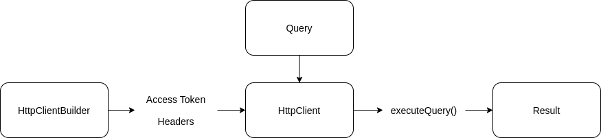

# Scala Client for GitHub GraphQL

Harish Venkataraman (hvenka8@uic.edu)

Karan Davanam (kdavan2@uic.edu)

Bhuvana Sridhara (bsridh5@uic.edu)

***

### Contents

* [Requirements](#markdown-header-requirements)
* [Building the code](#markdown-header-building-the-code) 
* [Description](#markdown-header-description)
* [Components](#markdown-header-components)
	* [Query Builder](#markdown-header-query-builder)
		* [Pagination Value](#markdown-header-paginationvalue)
		* [Operation](#markdown-header-operation)
	* [HTTP Client](#markdown-header-http-client)
		* [Serializer](#markdown-header-serializer)
		* [Deserializer](#markdown-header-deserializer)
	* [Scala Models](#markdown-header-scala-models)
* [Usage](#markdown-header-usage)
* [Class reference](#markdown-header-class-reference)
* [Areas of improvement](#markdown-header-areas-of-improvement)

### Requirements
* [Intellij](https://www.jetbrains.com/idea/)
* [SBT](https://www.scala-sbt.org/)

### Building the code
Run the following from the command line - 

* To test the code, run ```sbt test```
* To compile the code, run ```sbt compile ```
* To clean working directory, run ```sbt clean```
* You can chain the tasks using ```sbt clean compile test```
* To use the framework developed in this project, you can clone the repository and open the project in Intellij and run the commands from a main function using ```sbt run```. You can also run the code by opening the sbt shell in Intellij and typing ```run```
* The access token to access the API needs to be given in the ```application.conf``` file which is read in the application through [_Typesafe_](https://github.com/lightbend/config)
* To generate the Scaladoc, run ```sbt doc```

### Description

The framework is a GraphQL client for the [GitHub API](https://developer.github.com/v4/) written in Scala. It allows the user to compose queries to access different kinds of GraphQL objects, send the queries to the GitHub API, and unmarshall the JSON response into appropriate Scala classes for the developer to use in their Scala code. 

It mainly consists of three components - 

[](readme-resources/main-components.png)

As an overview, the __query builder__ component contains classes and functions used to compose queries in the format required by the GitHub API. The __HTTP client__ makes a connection with API server and sends the composed query. The response is then unmarshalled and stored in custom __Scala models__, which are just instances of Scala classes that represent the GraphQL objects. 

The framework makes use of the _abstract factory_ and _builder_ design patterns. The HTTP client in particular uses [_phantom types_](https://medium.com/@maximilianofelice/builder-pattern-in-scala-with-phantom-types-3e29a167e863) for compile-time checking. 

### Components

The query syntax required by the GitHub API is extensively documented and requires queries in a JSON format. Each query starts with a ```query``` keyword followed by curly braces inside which body of the query is defined.  In our framework, we currently support two kinds of queries - 

* __repository__ queries that look for a specific repository by name and owner
* __search__ queries that search across all repositories on GitHub based on some selection criteria 

All queries are instantiated using a factory class called [```Query```](src/main/scala/builders/Query.scala) which contains two methods for each of the queries that the framework supports. Each method takes arguments specific to its functionality to compose a query from scratch. Each method also has one argument that is particularly used to compose the body of the query. For finding a single repository, we use the ```findRepository()``` function that takes the name and owner as required arguments along with a ```RepositoryQueryBuilder``` instance. For searching across all repositories, we use the ```searchRepositories()``` function that takes a single instance of  ```SearchQueryBuilder``` as an argument. These two methods return a new instance of ```Query``` which contains a string called ```queryString``` set to the composed query and another string called ```returnType``` set to a custom value that indicates the GraphQL object that the query is supposed to return.

To jump straight to usage, click [here](#markdown-header-usage)!

#### Query Builder

All builder classes for query except [```SearchQueryBuilder```](src/main/scala/builders/SearchQueryBuilder.scala) extend the [```QueryBuilder```](src/main/scala/builders/QueryBuilder.scala) abstract class. Each query builder sub-class behaves as a builder class that assembles the query string from scratch based on the functions called from the builders. We ensure referential transparency by returning new copies of the builder instances everytime a function in the builder is called. 

The abstract class contains - 

* scalars - a list of strings that indicate scalar values in GraphQL
* fields - a list of type ```QueryBuilder``` representing fields in GraphQL that may contain subfields, scalars, and connections
 * connections - a list of type ```QueryBuilder``` representing connections in GraphQL

Additionally, ```QueryBuilder``` also defines a method called ```construct()``` that iterates through the above three lists and constructs the query string. For fields and connections, it recursively calls the ```construct()``` method since they may have subfields, scalars, and connections themselves.

Any class that extends ```QueryBuilder``` must provide functions that add to any of the three lists. For example, for a repository query we have a class called [```RepositoryQueryBuilder```](src/main/scala/builders/queryBuilders/RepositoryQueryBuilder.scala) that has functions to compose the body of the query. It has a function called ```includeName()``` which adds the scalar value ```"name"``` to the list of scalars. It also has a function called ```includeLanguages()``` that takes a [```LanguageQueryBuilder```](src/main/scala/builders/queryBuilders/LanguageQueryBuilder.scala) instance along with a [```PaginationValue```](src/main/scala/builders/PaginationValue.scala) instance that includes the ```"languages"``` connection to the connections list. The ```LanguageQueryBuilder``` instance provides methods to define the body of a language query and also extends the ```QueryBuilder``` abstract class so it can recursively call its ```construct()``` method. All the query builders except ```SearchQueryBuilder``` work in this pattern. We have implemented query builders for seven different kinds of GraphQL objects - 

[](readme-resources/query-builders.png)

##### SearchQueryBuilder

The ```SearchQueryBuilder``` is slightly different from the rest of the query builders because we need to construct two different kinds of queries - 

* the __query argument__ that provides filters to assist in the search of repositories
* the __query body__ which is the body of the search query that may specify subfields, scalars or connections

Hence, it does not extend ```QueryBuilder```. But we still have a ```construct()``` function to build the above strings.

Here, we constrain our search to repositories, so the ```type``` argument of the search query is permanently set to ```REPOSITORY```. We also provide an argument in the constructor called ```numberOfResults``` of type ```PaginationValue``` that specifies the number of results returned from the search. Additionally, there is also an argument called ```after``` in the constructor that is empty by default and can be set to return results after an ```endCursor```.

Most of the functions deal with constructing filters in the __query argument__. For example, the ```setSearchTerms()``` which takes a variable number of String arguments to set as search terms in the query argument. The ```setLanguages()``` function takes a variable number of String arguments representing languages to filter the search by language. 

There is only one function that deals with constructing the __query body__, which is the ```includeRepository()``` function that takes a ```RepositoryQueryBuilder``` instance as an argument. This instance  can be used to specify the sub-fields in the repository query body and gets included in the connections list, which is iterated by the ```construct()``` function. 

##### PaginationValue

```PaginationValue``` represents the number of results to be returned. It is a trait that is implemented by two case classes - ```First``` and ```Last```. Each case class takes an integer as a parameter that specifies the number of results to return either from the first or from the last. The functions that query connections inside a ```QueryBuilder``` sub-type all require a ```PaginationValue``` parameter. The ```SearchQueryBuilder``` also requires a ```PaginationValue``` parameter to specify the number of returned results.

##### Operation

For building the __query argument__ in ```SearchQueryBuilder```, some of the functions take an [```Operation```](src/main/scala/builders/Operation.scala) parameter. These represent comparison operations such as ```LessThan```, ```GreaterThan``` and ```Between```. All the ```Operation``` sub-types take integer parameters as operands for the respective operation. Some of the functions that take ```Operation``` argument involve filtering by number of stars, or number of followers, which can be found in ```SearchQueryBuilder```.

#### HTTP Client

The query built from the query builder component is encapsulated in an instance of the ```Query``` class that has a ```queryString``` along with it's getter.  This ```Query``` object is then sent to the HTTP client component returning the response from the API. 

[](readme-resources/http-client.png)

A [```HttpClient```](src/main/scala/client/HttpClient.scala) object is built using a [```HttpClientBuilder```](src/main/scala/client/HttpClientBuilder.scala). The ```HttpClientBuilder``` class is a class with a phantom type ```T```. An implicit called ```ev``` is set as the implicit parameter of the ```build()``` function. This implicit parameter can be satisfied only by calling the ```addBearer()``` function first, so figuratively speaking, the code will not compile unless the user provides an access token through the ```addBearer()``` function. To set the starting point for the mix-ins, we provide ```HttpEmpty``` as a type parameter when instantiating an object of type ```HttpClientBuilder```.

The ```build()``` function internally tests a sample query with the provided access token and returns an ```Option[HttpClient]``` object. This is ```None``` if the user has not provided the correct user token. This ```Option[HttpClient]``` is then flat-mapped into it's ```executeQuery()``` function which accepts a ```Query``` object as the argument. 

##### Serializer

The ```executeQuery()``` function first extracts the query string from the ```Query``` object and then converts it to a JSON object using the [_Gson_](https://github.com/google/gson) library. The converted JSON object is then serialized using Gson and sent with a HTTP post call to the GitHub API.

##### Deserializer

```executeQuery()``` also deserializes the JSON response into the appropriate Scala classes. It does so with the help of a _type parameter_ and _reflection_. 

Since we cannot determine the return of the query at compile time (it may be a search query or a repository query), we initially tried to return the super-type of ```Repository``` and ```Search```. But returning the super-type causes _object-slicing_  causing the loss of functions specific to either of the Scala classes. So instead, we push the responsibility of specifying the return type of the ```executeQuery()``` function onto the user who needs to provide the expected return type as a type parameter to the function. The function then uses reflection to verify the runtime type of return result with the type provided as a parameter to return a ```Some``` or ```None```. 

The deserializing takes place using the [_Jackson_](https://github.com/FasterXML/jackson-module-scala) module which takes a JSON response and a destination type and returns an object of the destination type with values filled from the JSON. The destination types include the Scala models defined to represent the GraphQL objects and are provided as type parameters to the ```execute()``` function.

#### Scala Models

To retrieve information from the API reponse and store it in Scala classes, we need to first create the Scala classes equivalent to the GraphQL objects. These are the __Scala models__.

We currently support the following GraphQL objects in our framework.

[](readme-resources/graphql-objects.png)

* The response to a query built using the ```findRepository()``` function needs to be put into a ```Repository``` object. This is specified in the type parameter for the ```executeQuery()``` function
* The response to a query built using the ```searchRepositories()``` function needs to be put into a ```Search``` object. This is specified in the type parameter for the ```executeQuery()``` function
* Each model has getters for each of it's fields

We also support the following connections. 

[](readme-resources/graphql-connections.png)

Naturally, the query builders can only query the information that is supported in these Scala models. Even if a field not supported in the models is queried, the response for that field would be lost because there is no corresponding receiver.

### Usage

We first need to set the access token in ```src/main/resources/application.conf```. We then read from ```application.conf``` - 

```scala
val config:Config = getConfigDetails("application.conf")
```
 
To create a ```HttpClient``` object, we instantiate using the ```HttpClientBuilder``` - 

```scala
val httpObject:Option[HttpClient] = new HttpClientBuilder[HttpEmpty]()
  .addBearerToken(
    config.getString("ACCESS_TOKEN")
  )
  .build
```

A sample GraphQL repository query looks like this - 

```json 
{ 
  repository(name:"incubator-mxnet", owner:"apache") { 
    url 
    forks(first:10) { 
      nodes {
        name
        isFork
        url 
      } 
    } 
  } 
}
```

The Scala equivalent with our builders looks like this - 

```scala
val query:Query = new Query()
  .findRepository(
    "incubator-mxnet",
    "apache",
    new RepositoryQueryBuilder()
      .includeUrl()
      .includeForks(
        new RepositoryQueryBuilder()
          .includeUrl()
          .includeIsFork()
          .includeName(), 
        new First(10)
      )
  )
```
To send the ```Query``` object to the API, use the ```HttpClient``` object - 

```scala
val result  = httpObject.flatMap(_.executeQuery[Repository](query))
```

As you can see above, the return type has been explicitely cast to ```Repository```.

To extract the forks information from the returned result - 

```scala
println(result.map(_.forks.nodes).getOrElse("None"))

Output:
List(Repository(mxnet,null,https://github.com/winstywang/mxnet,null,true,null,null,null,null), Repository(mxnet,null,https://github.com/zjucsxxd/mxnet,null,true,null,null,null,null), Repository(mxnet,null,https://github.com/ltheone/mxnet,null,true,null,null,null,null), Repository(mxnet,null,https://github.com/Poneyo/mxnet,null,true,null,null,null,null), Repository(mxnet,null,https://github.com/thirdwing/mxnet,null,true,null,null,null,null), Repository(mxnet,null,https://github.com/tqchen/mxnet,null,true,null,null,null,null), Repository(mxnet,null,https://github.com/TangXing/mxnet,null,true,null,null,null,null), Repository(mxnet,null,https://github.com/neuroidss/mxnet,null,true,null,null,null,null), Repository(mxnet,null,https://github.com/wavelets/mxnet,null,true,null,null,null,null), Repository(mxnet,null,https://github.com/surfcao/mxnet,null,true,null,null,null,null))
```

To get url of each of the forks from the results - 

```scala
println(result.map(_.forks.nodes.map(_.getUrl)).getOrElse("None"))

Output:
List(https://github.com/winstywang/mxnet, https://github.com/zjucsxxd/mxnet, https://github.com/ltheone/mxnet, https://github.com/Poneyo/mxnet, https://github.com/thirdwing/mxnet, https://github.com/tqchen/mxnet, https://github.com/TangXing/mxnet, https://github.com/neuroidss/mxnet, https://github.com/wavelets/mxnet, https://github.com/surfcao/mxnet)
```

A search query in GraphQL looks like this - 

```json
{ 
  search(query: " language:java,javascript,html, ai ml in:name,readme, stars:>5 forks:<=10", type:REPOSITORY, first:10) { 
    nodes { 
      ... on Repository { 
        createdAt 
        url 
        name 
      } 
    } 
    pageInfo 
    { 
      endCursor 
    } 
  } 
}
```

The Scala equivalent with our builders looks like this - 

```scala
val searchQueryBuilder: SearchQueryBuilder = new SearchQueryBuilder(
      new First(number = 10)
    )
      .includeRepository(
        new RepositoryQueryBuilder()
          .includeName()
          .includeUrl()
          .includeDateTime()
      )
      .setLanguages("java","javascript","html")
      .setSearchTerms("ai","ml")
      .setSearchInContent(SearchQueryBuilder.NAME,SearchQueryBuilder.README)
      .setNumberOfStars(new GreaterThan(5))
      .setNumberOfForks(new LesserThanEqualTo(10))
val query:Query = new Query().
  searchRepositories(searchQueryBuilder)
```

To send the ```Query``` object to the API, use the ```HttpClient``` object - 

```scala
val result  = httpObject.flatMap(_.executeQuery[Search](query))
```

As you can see above, the return type has been explicitely cast to ```Search```.

To extract repository URLs from the search result - 

```scala
println(result.map(_.nodes.map(_.getUrl)).getOrElse("None"))

Output:
List(https://github.com/fritzlabs/handwriting-detector-app, https://github.com/bentorfs/AI-algorithms, https://github.com/kylecorry31/ML4K-AI-Extension, https://github.com/intrepidkarthi/MLmobileapps, https://github.com/zoho-labs/Explainer, https://github.com/gnani-ai/API-service, https://github.com/rayleighko/training2018, https://github.com/refactoring-ai/predicting-refactoring-ml, https://github.com/onnx4j/onnx4j, https://github.com/hakmesyo/open-cezeri-library)
```

To extract repository names from the search result - 

```scala
println(result.map(_.nodes.map(_.getRepositoryName)).getOrElse("None"))

Output:
List(handwriting-detector-app, AI-algorithms, ML4K-AI-Extension, MLmobileapps, Explainer, API-service, training2018, predicting-refactoring-ml, onnx4j, open-cezeri-library)
```

To extract the ```endCursor``` from the returned result and pass it to the same query, we can take advantage of the ```copy()``` method of Scala case classes - 

```scala
val endCursor: String = results.map(_.getPageInfo.getEndCursor).getOrElse("None")
val newSearchQueryBuilder: SearchQueryBuilder = searchQueryBuilder.copy(after=endCursor)
val query:Query = new Query().searchRepositories(newSearchQueryBuilder)
``` 

### Class reference

The generated Scaladoc can be used as API documentation for instructions on how to build different kinds of queries. We have implemented seven query builders to query seven different kinds of GraphQL objects under the ```findRepository()``` function. The below are the links to the specific classes.

* [```RepositoryQueryBuilder```](src/main/scala/builders/queryBuilders/RepositoryQueryBuilder.scala)
* [```UserQueryBuilder```](src/main/scala/builders/queryBuilders/UserQueryBuilder.scala)
* [```IssueQueryBuilder```](src/main/scala/builders/queryBuilders/IssueQueryBuilder.scala)
* [```LanguageQueryBuilder```](src/main/scala/builders/queryBuilders/LanguageQueryBuilder.scala)
* [```RepositoryTopicQueryBuilder```](src/main/scala/builders/queryBuilders/RepositoryTopicQueryBuilder.scala)
* [```TopicQueryBuilder```](src/main/scala/builders/queryBuilders/TopicQueryBuilder.scala)
* [```RepositoryOwnerQueryBuilder```](src/main/scala/builders/queryBuilders/RepositoryOwnerQueryBuilder.scala)

For searching across all the repositories, the [```SearchQueryBuilder```](src/main/scala/builders/SearchQueryBuilder.scala) has been provided.

### Areas of improvement

* __Design__ - Ideally, we would not like to separate the query building functionality from the Scala models. Combining the two gives us a way to specify queries by specifying their corresponding Scala models making query building more intuitive
* __Repeated functionality__ - All the functions in the ```QueryBuilder``` sub-types do a finite set of tasks which can be further abstracted avoiding a lot of task repetition. For example, they all add to the scalars, fields or connections, so there is scope for further abstraction
* __Deserializing__ - As mentioned in the [Deserializer](#markdown-header-deserializer) subsection, the returned results need to be explicitely cast into the specific Scala model so we can use the functionality of the model. This could be improved
* __Phantom types for query builders__ - A user can build an incorrect query by not specifying any subfields in the query builder. This is caught only at runtime when the response returns a null. We could force correct query building at compile time using phantom types
